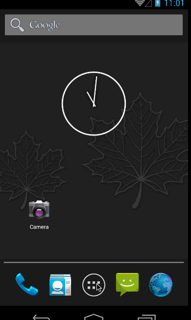

# Simple Todo Demo

This is my implementation of the Simple Todo List that's described here: http://courses.codepath.com/snippets/intro_to_android/prework

Time spent: 2 hours spent in total

Completed user stories:

 * [x] Required: Sucessfully add and remove items
 * [x] Required: Editing todo items
 * [x] Required: Persist todo items

Extensions:

 * [x] Optional: Persist todo items into SQLite
 * [x] Optional: Use custom adapter
 * [x] Optional: Use DialogFragment instead of Activity

Walkthrough of all user stories:

GIF created with [LiceCap](http://www.cockos.com/licecap/).

